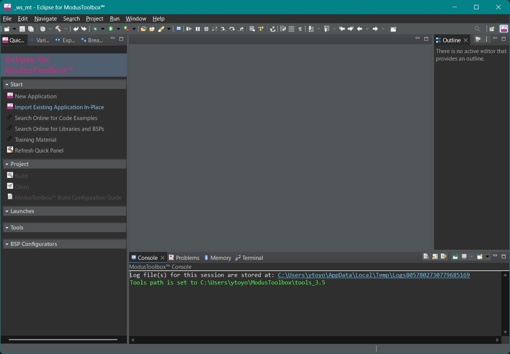
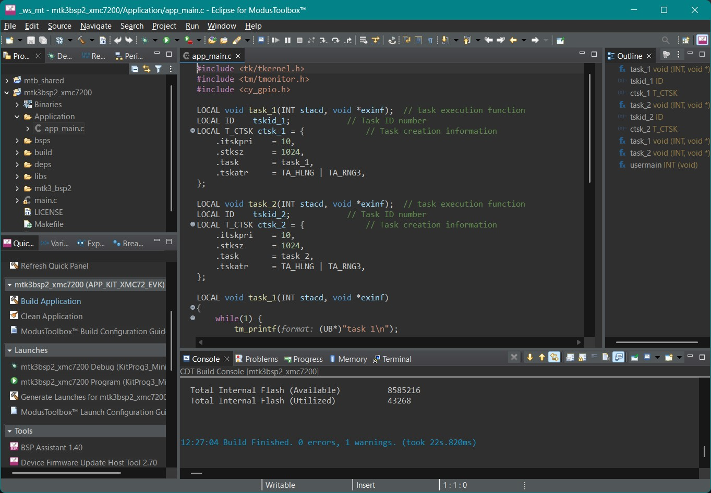
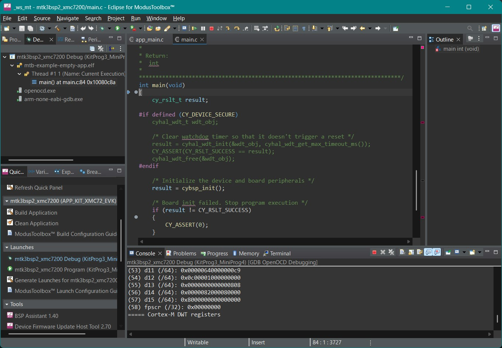

# μT-Kernel 3.0 BSP2 Start Guide <!-- omit in toc -->
## ModusToolbox & KIT_XMC72_EVK Edition Rev.01.00.01 <!-- omit in toc -->
## 2025.06.04 <!-- omit in toc -->
# About this Start Guide <!-- omit in toc -->
- This Start Guide explains the basic methods for creating and debugging programs to run on a microcontroller board, using μT-Kernel 3.0 BSP2 and the IDE (Integrated Development Environment) provided by the microcontroller manufacturer. 
  - For more detailed information on μT-Kernel 3.0 BSP2, the microcontroller, IDE, etc., please refer to their respective documentation.
- This Start Guide covers Infineon's ModusToolbox and the microcontroller board KIT_XMC72_EVK. 
  - Operation has been verified on Eclipse IDE for ModusToolbox 3.5.0.

# Table of Contents <!-- omit in toc -->
- [Preparation](#preparation)
  - [Downloading μT-Kernel 3.0 BSP2](#downloading-μt-kernel-30-bsp2)
  - [Installing ModusToolbox](#installing-modustoolbox)
- [Creating the Project](#creating-the-project)
  - [Launching ModusToolbox](#launching-modustoolbox)
  - [Importing the Project](#importing-the-project)
  - [Viewing the Project](#viewing-the-project)
  - [Building the Project](#building-the-project)
- [Running and Debugging the User Program](#running-and-debugging-the-user-program)
  - [Creating a User Program](#creating-a-user-program)
  - [Running and Debugging the Program](#running-and-debugging-the-program)
  - [Debug Serial Output](#debug-serial-output)
  - [Controlling Peripherals](#controlling-peripherals)
- [Revision History](#revision-history)

# Preparation
## Downloading μT-Kernel 3.0 BSP2
- Download the μT-Kernel 3.0 BSP2 project mtk3bsp2_xmc7200.zip. 
  - https://github.com/tron-forum/mtk3bsp2_samples/tree/main/IDE_Projects
- Extract the ZIP file into any directory. 
  - Be careful not to include Japanese characters in the path name of the extraction directory.  

## Installing ModusToolbox
- Download and install the ModusToolbox installer from: 
  - https://www.infineon.com/cms/jp/design-support/tools/sdk/modustoolbox-software/ 
  - For more details about ModusToolbox, please see the above website.
- The installer will install ModusToolbox Setup. Run the ModusToolbox Setup, check **Eclipse IDE for ModusToolbox 2025.4** and **Modus Toolbox Tools Package 3.5.0**, and complete the installation.  

# Creating the Project
## Launching ModusToolbox
- Launch the installed ModusToolbox. 
- You will be prompted for a workspace at startup. Specify any directory. The IDE settings and data will be saved there.  

## Importing the Project
1. In the Quick Panel, select **Import Existing Application In-Place**. 
2. Click the **Browse** button next to **Project Location** and specify the BSP2 project directory. 
3. Click **Finish**.

## Viewing the Project
- Once the import completes successfully, the μT-Kernel 3.0 BSP2 project will appear in the Project Manager. 
- Double-clicking a file opens it for viewing and editing.

## Building the Project
- Click the project name in the Project Manager and select **Build Application** from the Quick Panel. 
- The build will start, and when it finishes successfully, **Build Finished.** will be displayed.

# Running and Debugging the User Program
## Creating a User Program
- Write your user program in the **Application** directory of the  μT-Kernel 3.0 BSP2. 
  - You can create the user program directory in any location. 
  - Keeping it separate from other directories makes it easier to migrate when BSP2 is updated.
- In the initial state, the app_main.c file contains a program that runs two tasks, each blinking an LED on the board and producing debug serial output.

## Running and Debugging the Program
- Connect the board (KIT_XMC72_EVK) to the PC via USB.

- The USB interface serves as both the debugger I/F and the serial communication I/F.
- With the project selected, choose **mtk3bsp2_xmc7200 Debug(KitProg3_MiniProg4)** from the Quick Panel.

- When debugging starts, it will break at the main function in main.c. 
  - This initial breakpoint can be changed in the **Run/Restart Commands** section of the **Startup** tab in **Debug Configuration**.
- Basic debugging operations are available from the toolbar buttons. 
- For more information on using ModusToolbox, please refer to the manufacturer's website.

## Debug Serial Output
- Debug serial output from the program on the board using the tm_printf function is sent to the PC's virtual serial port over USB. 
- By running terminal software on the PC, you can view the debug serial output. 
  - You can use terminal software such as Tera Term on the PC. 
  - Configure the serial communication as follows:  

| Baud Rate | Data Bits | Parity | Stop Bits | Flow Control |
|-----------|-----------|--------|-----------|--------------|
| 115200    | 8bit      | none   | 1bit      | none         |

## Controlling Peripherals
- The μT-Kernel 3.0 BSP2 includes sample device drivers for the A/D converter and I2C communication. 
  - From the sample device drivers, the following signals on the Arduino-compatible connector of the KIT_XMC72_EVK board are available. 
  - Other signals can also be used by modifying the project configuration, etc.

| Signal Name  | Device Name | Function                   |
| ------------ | ----------- | -------------------------- |
| Arduino A0   | hadcb       | Analog Input               |
| Arduino A1   | hadcb       | Analog Input               |
| Arduino I2C   | hiici       | I2C Communication (Master) |

# Revision History
| Version | Date       | Description     |
| ------- | ---------- | --------------- |
| 1.00.01 | 2025.06.04 | Initial release (The version number is the same as the Japanese version) |