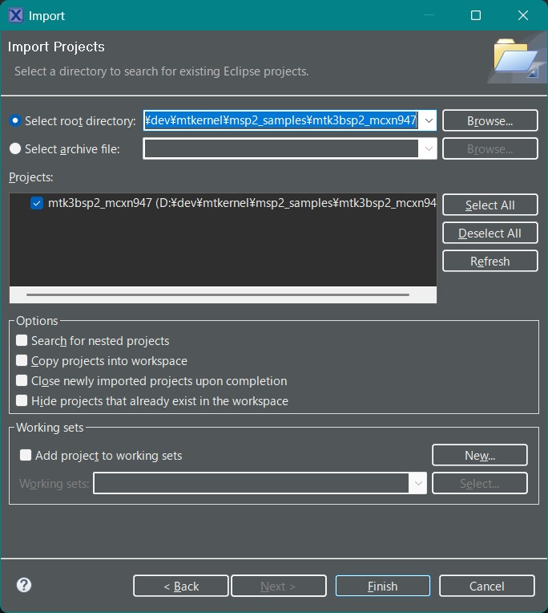
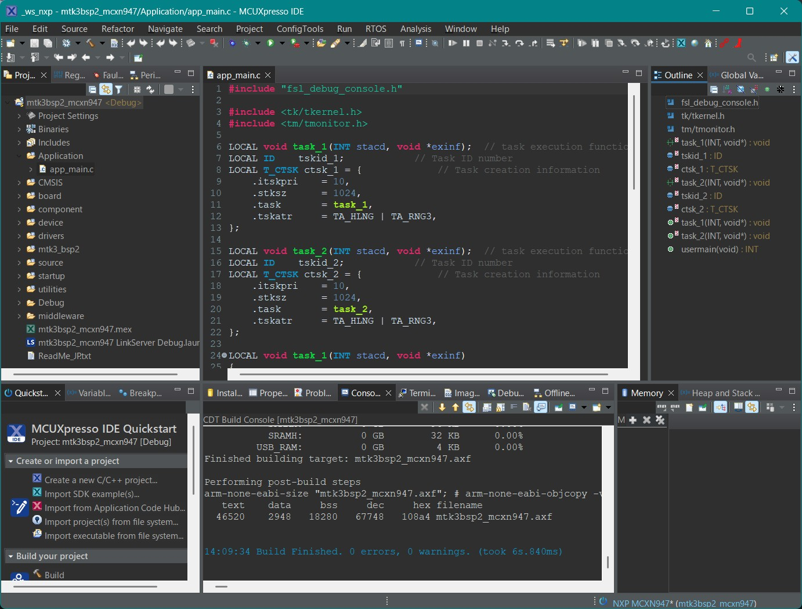
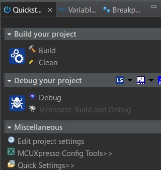
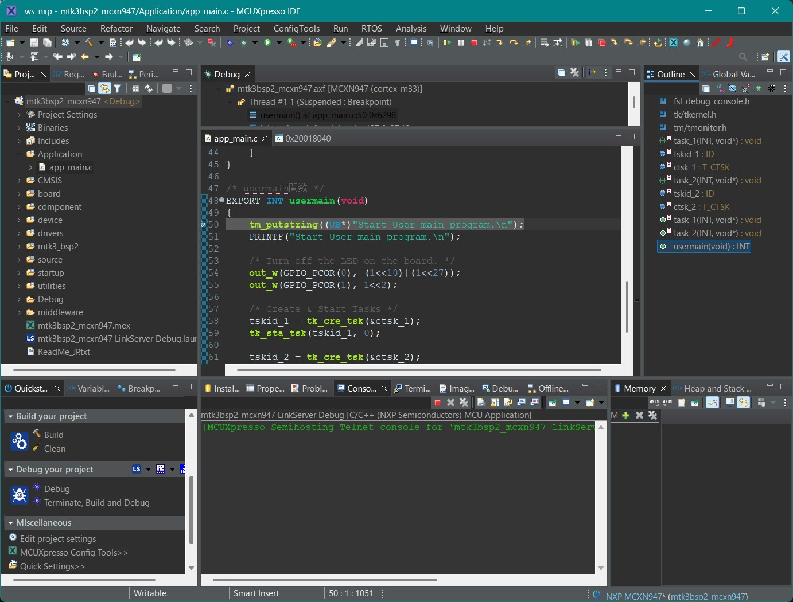
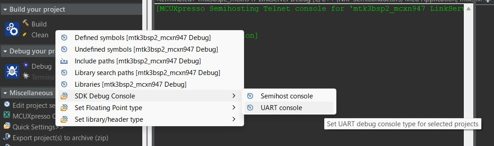

# μT-Kernel 3.0 BSP2 Startup Guide <!-- omit in toc -->
## MCUXpresso IDE & FRDM-MCXN947 Edition Rev.01.00.01 <!-- omit in toc -->
## 2025.06.04 <!-- omit in toc -->
# About This Startup Guide
This guide explains the basic steps for creating and debugging programs running on a microcontroller board using μT-Kernel 3.0 BSP2 and the IDE provided by the MCU manufacturer. 
For detailed information on μT-Kernel 3.0 BSP2, the microcontroller, the IDE, etc., please refer to their respective manuals. 
This document specifically covers NXP's MCUXpresso IDE and the FRDM-MCXN947 board. 
All procedures were verified on MCUXpresso IDE version 24.12.148.

# Table of Contents <!-- omit in toc -->
- [About This Startup Guide](#about-this-startup-guide)
- [Preparation](#preparation)
  - [Downloading μT-Kernel 3.0 BSP2](#downloading-μt-kernel-30-bsp2)
  - [Installing MCUXpresso IDE](#installing-mcuxpresso-ide)
- [Creating a Project](#creating-a-project)
  - [Running MCUXpresso IDE](#running-mcuxpresso-ide)
  - [Installing MCUXpresso SDK](#installing-mcuxpresso-sdk)
  - [Importing a Project](#importing-a-project)
  - [Viewing the Project](#viewing-the-project)
  - [Building the Project](#building-the-project)
- [Running and Debugging the User Program](#running-and-debugging-the-user-program)
  - [Creating a User Program](#creating-a-user-program)
  - [Running and Debugging the Program](#running-and-debugging-the-program)
  - [Debug Serial Output](#debug-serial-output)
- [Peripheral Control](#peripheral-control)
- [Revision History](#revision-history)

# Preparation
## Downloading μT-Kernel 3.0 BSP2

- Download the μT-Kernel 3.0 BSP2 project archive `mtk3bsp2_mcxn947.zip` from: 
  - https://github.com/tronforum/mtk3bsp2_samples/tree/main/IDE_Projects 

- Extract the ZIP to any directory. 
  - Ensure the extraction path does not contain Japanese characters.

## Installing MCUXpresso IDE
- Download and run the MCUXpresso IDE installer from: 
  - https://www.nxp.jp/design/designcenter/software/developmentsoftware/mcuxpressosoftwareandtools/mcuxpressointegrateddevelopmentenvironmentide:MCUXpressoIDE 
  - For more details on MCUXpresso IDE, see the above website.

# Creating a Project
## Running MCUXpresso IDE
- Launch the installed MCUXpresso IDE. 
  - When prompted for a workspace at startup, specify any directory; the IDE will store its settings there.

## Installing MCUXpresso SDK
- From the Welcome screen, choose **Download and Install SDKs**, then install the **frdmmcxn947** SDK. 

## Importing a Project
1. In the menu, select **File → Import**. 
2. In the dialog, choose **General → Existing Projects into Workspace**, then **Next**. 
3. Click **Browse** next to **Select root directory** and point to the BSP2 project folder. 
4. Confirm the project appears, then click **Finish**. 

## Viewing the Project
- After a successful import, the μT-Kernel 3.0 BSP2 project appears in the Project Explorer. 
- Double-click any file to view and edit its contents. 

## Building the Project
- Right-click the project name in the Project Explorer and select **Build Project**. 
- When the build completes successfully, “Build Finished.” appears in the console. 

# Running and Debugging the User Program
## Creating a User Program
- Place your application code under the **Application** directory of μT-Kernel 3.0 BSP2. 
  - You can create the user program directory anywhere.
  - Keeping it separate from the other directories makes migration easier when upgrading BSP2.
- By default, app_main.c implements two tasks that toggle LEDs and send debug messages via serial. 

## Running and Debugging the Program
- Connect the FRDM-MCXN947 board to your PC via USB (serving as both debugger and serial interface). 
- In the [Quickstart Panel], click [Debug your project] → [Debug], or use the toolbar button to start debugging.

- Debugging stops at the usermain function in app_main.c.
- Use the menu-bar buttons for standard debug operations.
  - For full IDE usage, see NXP's documentation. 

## Debug Serial Output
- Use the SDK's PRINTF function for debug output. 

- In the Quickstart Panel, under [Miscellaneous] → [Quick Setting] → [SDK Debug Console], select either: 
  - Semihost console 
  - UART console 

- If [UART console] is chosen, output appears on the PC's USB virtual COM port.
- Run a terminal emulator (e.g., Tera Term) on your PC to view the output. 
  - Use the following serial settings:

| Baud Rate | Data Bits | Parity | Stop Bits | Flow Control |
|-----------|-----------|--------|-----------|--------------|
| 115200    | 8         | none   | 1         | none         |
# Peripheral Control
- μT-Kernel 3.0 BSP2 includes sample drivers for the A/D converter and I2C.
  - These drivers use signals on the FRDM-MCXN947's Arduino-compatible header by default. 
  - Other signals can be enabled by modifying the project configuration. 

| Signal Name  | Device Name | Function                   |
| ------------ | ----------- | -------------------------- |
| Arduino A0   | hadca       | Analog Input               |
| Arduino A1   | hadca       | Analog Input               |
| Arduino I2C   | hiica       | I2C Communication (Master) |

# Revision History
| Version | Date       | Description     |
|---------|------------|-----------------|
| 1.00.01 | 2025.06.04 | Initial release (The version number is the same as the Japanese version) |