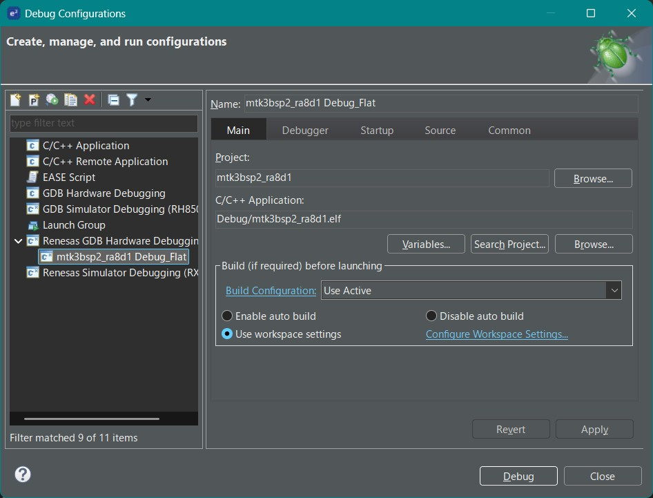

# μT-Kernel 3.0 BSP2 Start Guide <!-- omit in toc -->
## e² studio & RA Microcontroller Edition Rev.01.00.02 <!-- omit in toc -->
## 2025.10.22 <!-- omit in toc -->
# About This Start Guide <!-- omit in toc -->
- This start guide explains the basic steps for creating and debugging programs running on microcontroller boards using μT-Kernel 3.0 BSP2 and the IDE provided by the microcontroller vendor.
  -  For detailed information on μT-Kernel 3.0 BSP2, the microcontroller, the IDE, etc., please refer to their respective documentation.

- In this guide, we cover Renesas Electronics' IDE e² studio and the following microcontroller boards.
- μT-Kernel 3.0 BSP2 projects may depend on the version of e² studio used. The following versions have been confirmed to work.  
  - e² studio 2025-04 (FSP v5.9.0)
      - EK-RA8M1        
      - EK-RA8D1
      - RA4M1 Clicker
  - e² studio 2025-10 (FSP v6.2.0)
      - Arduino UNO R4 MINIMA

# Table of Contents <!-- omit in toc -->
- [Preparation](#preparation)
  - [Downloading μT-Kernel 3.0 BSP2](#downloading-μt-kernel-30-bsp2)
  - [Installing e² studio](#installing-e-studio)
- [Creating a Project](#creating-a-project)
  - [Running e² studio](#running-e-studio)
  - [Importing the Project](#importing-the-project)
  - [Viewing the Project](#viewing-the-project)
  - [Building the Project](#building-the-project)
- [Running and Debugging the User Program](#running-and-debugging-the-user-program)
  - [Creating the User Program](#creating-the-user-program)
  - [Creating a Debug Configuration](#creating-a-debug-configuration)
  - [Debug Execution](#debug-execution)
- [Peripheral Control](#peripheral-control)
- [Debug Serial Output](#debug-serial-output)
- [Debug Output via SEGGER RTT](#debug-output-via-segger-rtt)
- [Change History](#change-history)


# Preparation
## Downloading μT-Kernel 3.0 BSP2
- Download the sample project for your target microcontroller board from:
  - https://github.com/tronforum/mtk3bsp2_samples/tree/main/IDE_Projects

- Choose one of the following ZIP files:
  - For EK-RA8M1: mtk3bsp2_ra8m1.zip
  - For EK-RA8D1: mtk3bsp2_ra8d1.zip
  - For RA4M1 Clicker: mtk3bsp2_ra4m1clicker.zip
  - Arduino UNO R4 MINIMA:  mtk3bsp2_ra4m1_arduno.zip
  
- Unzip the file into a directory of your choice. 
  - Be careful not to include Japanese characters in the path.

## Installing e² studio
- Download and run the Flexible Software Package (FSP) installer from:
  - https://www.renesas.com/jp/ja/software/tool/flexible-software-package/fsp
  - This installer also installs the e² studio IDE. For more details, see the website above.

# Creating a Project
## Running e² studio
- Launch the installed e² studio. 
  - When prompted for a workspace, specify any directory. This is where IDE settings and metadata will be stored.

## Importing the Project
1. From the menu select [File] → [Import]. 
2. In the dialog, choose [General] → [Existing Projects into Workspace] and click [Next]. 
3. Click [Browse] next to [Select root directory] and point to the unzipped BSP2 project folder. 
4. Confirm the project appears in the list and click [Finish].


## Viewing the Project
- After a successful import, the μT-Kernel 3.0 BSP2 project appears in the Project Explorer. 
  - If the Welcome screen is covering the view, close it by clicking [X]. 
  - If the FSP has been updated, you'll be prompted to install the matching version—click [Apply and Close]. 
- Double-clicking any file opens it for editing.

## Building the Project
- Right-click the project in Project Explorer and select [Build Project]. 
- When the build completes successfully, you will see "Build Finished."

  


# Running and Debugging the User Program
## Creating the User Program
- Write your application code under the Application directory of the μT-Kernel 3.0 BSP2 project. 
  - You can create this directory anywhere you like.
  - Keeping it separate from the BSP2 files makes future BSP upgrades easier.
- By default, app_main.c contains two tasks: one toggles the board LEDs and the other outputs debug messages over serial.

## Creating a Debug Configuration
- With the project selected, go to [Run] → [Debug Configurations]. 

- In the dialog that appears, select the debug configuration for the target project from [Renesas GDB Hardware Debugging]. The debug configuration is displayed named [`project_name` Debug_Flat]. 
  - If it's not present, double-click **Renesas GDB Hardware Debugging** to create a new one automatically (do this right after building).
- For example, on EK-RA8M1 the configuration is named mtk3bsp2_ra8m1 Debug_Flat.

 

- Select [Debugger] tab and confirm the following:
  - Debug hardware: J-Link ARM 
  - Target Device: (select your MCU model)

 

- Select [Startup] tab and configure the following:
- Breakpoint at: usermain 
  - This function will get an initial breakpoint on debug start.

 

- For microcontroller boards that do not have debug hardware, such as Arduino UNO R4 MINIMA, please configure them according to the debug hardware you will be using.  
  - The settings for using Arduino UNO R4 MINIMA and E2 Lite are shown below.    
    - Select [Connection Settings] in the [Debugger] tab and set it as shown in the figure below.  

    

## Debug Execution
- Connect the microcontroller board to your PC via USB. (For microcontroller boards that do not have debug hardware, such as Arduino UNO R4 MINIMA, please connect the PC via debug hardware.)
- If using serial output, also connect the board's UART to the PC via a USB-serial adapter. 
- In the Debug Configurations dialog, click [Debug]. The IDE will program the board and start the debug session. 
- When prompted to switch to the [Debug Perspective], click [Switch].

- Execution will halt first in the Reset_Handler, then break at usermain in app_main.c. 
- Use the toolbar buttons to step through your code.
  - For more details on e² studio, consult Renesas's documentation.

# Peripheral Control
- μT-Kernel 3.0 BSP2 includes sample drivers for ADC and I2C.
  - The signals from the Arduino or mikroBUS connector on the microcontroller board can be used. 
  - Additional signals can be enabled by adjusting the project's configuration.
- For EK-RA8M1 and EK-RA8D1:

| Signal Name  | Device Name | Function                   |
| ------------ | ----------- | -------------------------- |
| Arduino A0   | hadca       | Analog Input               |
| Arduino A1   | hadca       | Analog Input               |
| Arduino I2C   | htiica     | I2C Communication (Master) |

- For RA4M1 Clicker:

| Signal Name      | Device Name | Function                   |
| ---------------- | ----------- | -------------------------- |
| mikroBUS AN      | hadca       | Analog Input               |
| mikroBUS SCL/SDA | hiica       | I2C Communication (Master) |

- For Arduino UNO R4 MINIMA:

| Signal Name  | Device Name | Function                   |
| ------------ | ----------- | -------------------------- |
| Arduino A0   | hadca       | Analog Input               |
| Arduino A1   | hadca       | Analog Input               |
| Arduino I2C   | hsiica     | I2C Communication (Master) |

# Debug Serial Output
- Use tm_printf in your code to send debug messages over the board's UART. 
- シリアル通信信号はマイコンボードのArduinoまたはmikroBUSコネクタのUART信号を使用しています。
  
  | 信号          | EK-RA8M1   | EK-RA8D1   | Arduino UNO R4 | RA4M1 Clicker |
  | ----------- | ---------- | ---------- | -------------- | ------------- | 
  | Arduino TX  | P310(TXD3) | P409(TXD3) | P302(TXD2)     | -             | 
  | Arduino RX  | P309(RXD3) | P408(RXD3) | P301(RXD2)     | -             | 
  | mikroBUS TX | -          | -          | -              | P411(TXD0)    | 
  | mikroBUS RX | -          | -          | -              | P410(RXD0)    | 

- Run a terminal emulator (e.g., Tera Term) on your PC to view the output. 
  - Use the following serial settings:
  
| Baud Rate | Data Bits | Parity | Stop Bits | Flow Control |
| --------- | --------- | ------ | --------- | ------------ |
| 115200    | 8         | none   | 1         | none         |

# Debug Output via SEGGER RTT
- The J-Link debugger supports RTT (Real-Time Transfer). 
  - Use SEGGER_RTT_printf in your code to output debug messages via RTT.
  - For more information, see: 
  https://www.segger.com/products/debug-probes/j-link/technology/about-real-time-transfer/
- On the PC, launch the J-Link RTT Viewer and configure it for your target microcontroller.


# Change History
| Version  | Date       | Description |
| -------- | ---------- | ----------- |
| 1.00.02 | 2025.10.22 | Add Arduino UNO R4 MINIMA microcontroller board |
| 1.00.01  | 2025.06.04 | Initial release (The version number is the same as the Japanese version) |
```