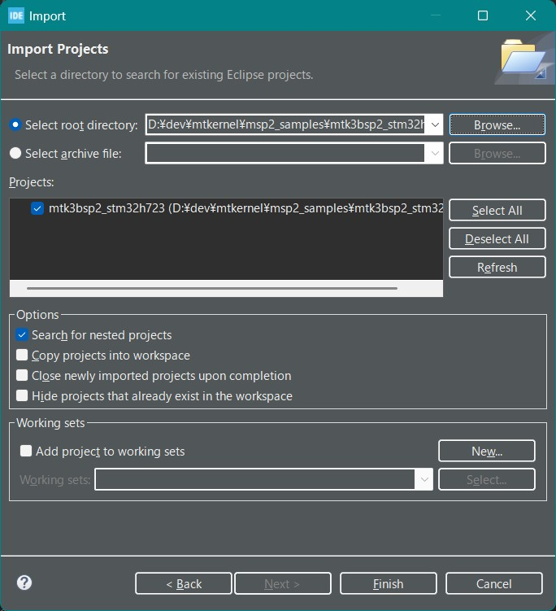
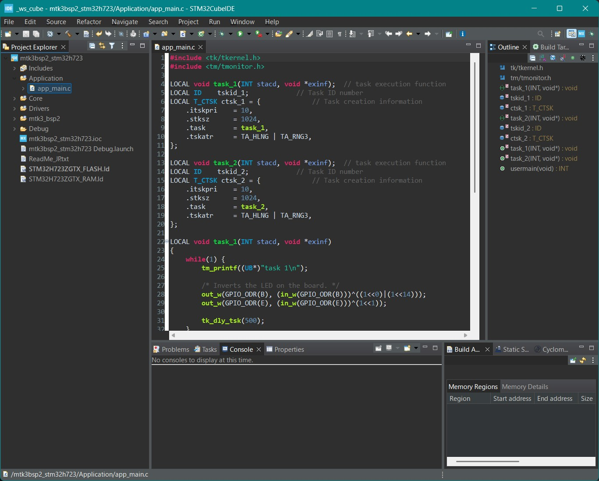
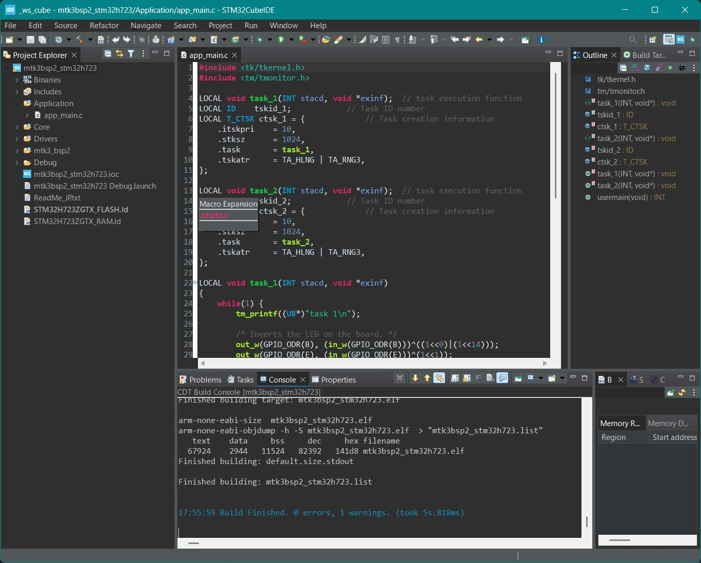
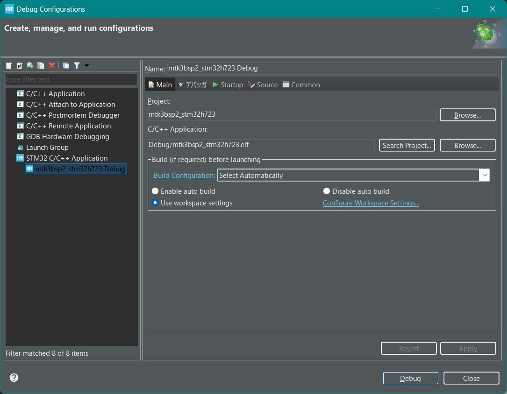

# μT-Kernel 3.0 BSP2 Start Guide <!-- omit in toc --> 
## STM32Cube & NUCLEO-H723ZG Edition  Rev.01.00.01 <!-- omit in toc --> 
## 2025.06.02 <!-- omit in toc -->
## About this Start Guide <!-- omit in toc -->
This start guide explains the basic methods for creating and debugging programs running on the NUCLEO‐H723ZG microcontroller board, using μT-Kernel 3.0 BSP2 and the IDE (integrated development environment) provided by the microcontroller manufacturer.
For detailed information about μT-Kernel 3.0 BSP2, the microcontroller, the IDE, etc., please refer to their respective documentation.
This guide covers STMicroelectronics' IDE STM32CubeIDE and the NUCLEO-H723ZG board. It was verified to work with STM32CubeIDE 1.18.1.

# Contents <!-- omit in toc -->
- [Preparation](#preparation)
  - [Downloading μT-Kernel 3.0 BSP2](#downloading-μt-kernel-30-bsp2)
  - [Installing STM32CubeIDE](#installing-stm32cubeide)
- [Creating the Project](#creating-the-project)
  - [Running STM32CubeIDE](#running-stm32cubeide)
  - [Importing the Project](#importing-the-project)
  - [Viewing the Project](#viewing-the-project)
  - [Building the Project](#building-the-project)
- [Running and Debugging User Programs](#running-and-debugging-user-programs)
  - [Creating a User Program](#creating-a-user-program)
  - [Creating a Debug Configuration](#creating-a-debug-configuration)
  - [Debug Execution](#debug-execution)
  - [Controlling Peripherals](#controlling-peripherals)
  - [Debug Serial Output](#debug-serial-output)
- [Revision History](#revision-history)

# Preparation
## Downloading μT-Kernel 3.0 BSP2
- Download the μT-Kernel 3.0 BSP2 project `mtk3bsp2_stm32h723.zip` from: 
  - https://github.com/tronforum/mtk3bsp2_samples/tree/main/IDE_Projects 
- Extract the ZIP file into a directory of your choice. 
  - Make sure that the path to the extraction directory does not contain Japanese characters.

## Installing STM32CubeIDE
- Download and install the STM32CubeIDE installer from: 
  - https://www.st.com/ja/development-tools/stm32cubeide.html
  - For more details about STM32CubeIDE, please refer to the website above.

# Creating the Project
## Running STM32CubeIDE
- Launch the installed STM32CubeIDE. 
  - On startup, you will be asked to select a workspace. Choose any directory; this will store the IDE's configuration and project metadata.

## Importing the Project
1. From the menu, select [File] → [Import]. 
2. In the dialog, choose [General] → [Existing Projects into Workspace] and click [Next]. 
3. Click [Browse] next to [Select root directory], and select the BSP2 project directory you extracted. 
4. Confirm that the BSP2 project is listed, then click [Finish].

## Viewing the Project
- Once the import completes successfully, the μT-Kernel 3.0 BSP2 project appears in the Project Explorer. 
- Double-click any file to view or edit its contents.

## Building the Project
- Right-click the project name in the Project Explorer and select **Build Project**. 
- The build process starts, and once it finishes successfully, **Build Finished.** is displayed.

# Running and Debugging User Programs
## Creating a User Program
- Place your user program in the Application directory of the μT-Kernel 3.0 BSP2 project. 
  - You may create this directory anywhere.
  - Keeping it separate helps when upgrading the BSP2 version later.
- By default, app_main.c contains a sample program that creates two tasks. Each task toggles an onboard LED and outputs debug messages via serial.

## Creating a Debug Configuration
- With the BSP2 project selected in the Project Explorer, go to [Run] → [Debug Configurations].

- In the dialog, under [STM32 C/C++ Application], select [mtk3bsp2_stm32h723 Debug].
  - If it's not listed, double-click [STM32 C/C++ Application]; the most recently built project will be used. Always do this right after building.

## Debug Execution
-  Connect the microcontroller board to your PC via USB. 
 - The USB port serves as both the debugger interface and the serial communication interface. 
- Click the [Debug] button in the dialog. The firmware is downloaded to the board, and debugging starts. 
- When prompted to switch to the [Debug perspective], click [Switch]. 

- Debugging will halt at the usermain function in app_main.c. 
- Use the toolbar buttons to perform common debug operations.
  - For more details on STM32CubeIDE usage, refer to ST's website.

## Controlling Peripherals
- μT-Kernel 3.0 BSP2 includes sample device drivers for the A/D converter and I²C. 
  - These drivers can access the following signals on the NUCLEO-H723ZG board's Arduino-compatible connectors. 

| Signal Name  | Device Name | Function                   |
| ------------ | ----------- | -------------------------- |
| Arduino A0   | hadca       | Analog Input               |
| Arduino A1   | hadca       | Analog Input               |
| Arduino I2C   | hiica       | I2C Communication (Master) |

  - Other signals can be enabled by changing the project configuration.

## Debug Serial Output
- Debug messages printed via tm_printf in your program are sent to the PC's USB virtual COM port. 
- Run a terminal emulator (e.g., Tera Term) on your PC to view the output. 
  - Use the following serial settings:
  
| Speed  | Data Bits | Parity | Stop Bits | Flow Control |
| ------ | --------- | ------ | --------- | ------------ |
| 115200 | 8         | none   | 1         | none         |

# Revision History
| Version  | Date       | Description          |
| -------- | ---------- | -------------------- |
| 1.00.01  | 2025.06.02 | Initial creation (The version number is the same as the Japanese version)|
