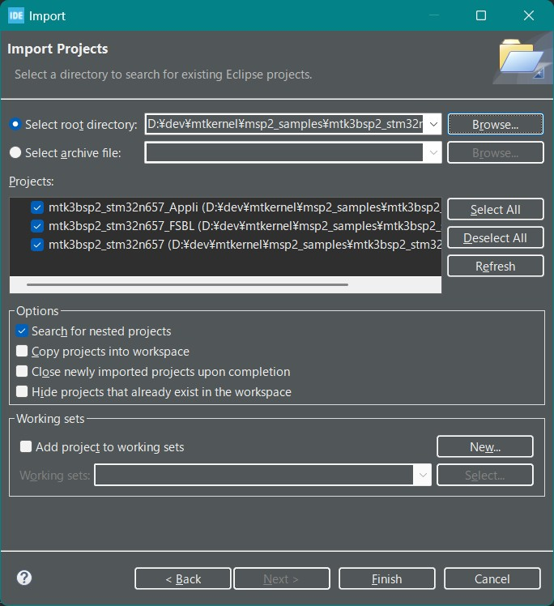
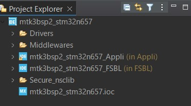
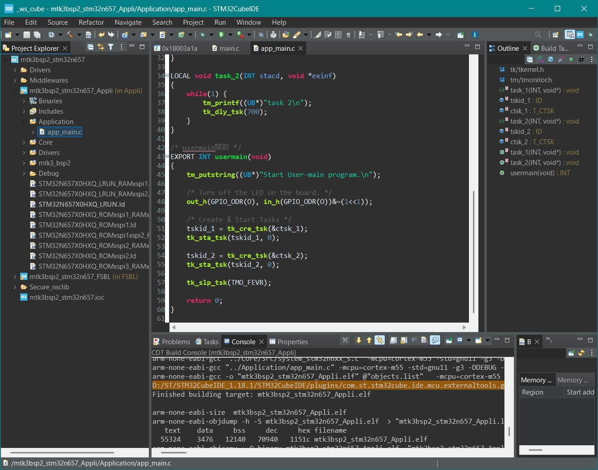
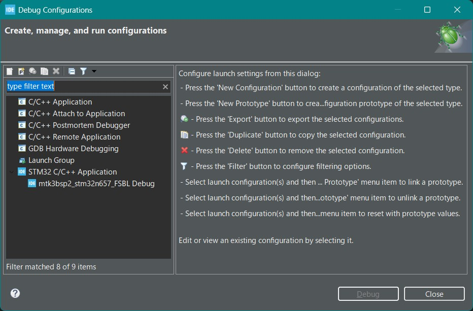
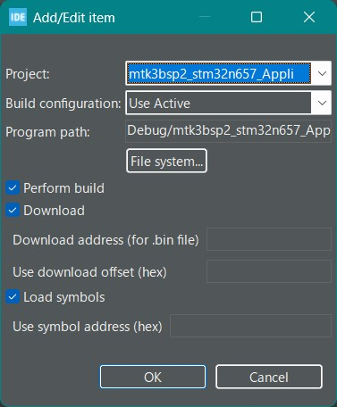
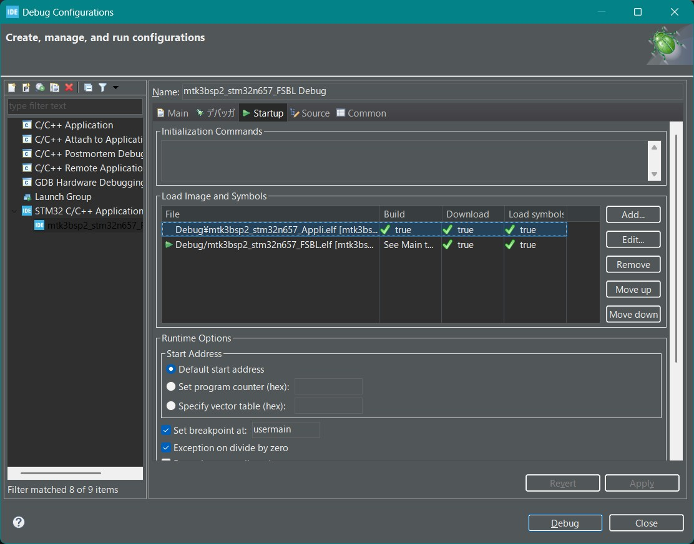

# μT-Kernel 3.0 BSP2 Start Guide <!-- omit in toc -->
## STM32Cube & STM32N6570-DK Edition Rev.01.00.00 <!-- omit in toc -->
## 2025.06.02 <!-- omit in toc -->
## About This Start Guide <!-- omit in toc -->
- This start guide explains the basic procedures for creating and debugging programs that run on a microcontroller board using μT Kernel 3.0 BSP2 together with the IDE (Integrated Development Environment) provided by the microcontroller manufacturer.
  - For detailed information on μT Kernel 3.0 BSP2, the microcontroller, the IDE, etc., please refer to their respective documentation.
- In this guide, we cover STMicroelectronics' IDE STM32CubeIDE and the STM32N6570-DK microcontroller board.
  - We have verified operation on STM32CubeIDE 1.18.1.
- The STM32N657 has TrustZone enabled. μT Kernel 3.0 runs only in secure mode; non-secure mode is not used. 
  - The sample project consists of an FSBL (First Stage Boot Loader) and a secure application. The FSBL loads the application from FLASH into RAM and then executes it.

# Table of Contents<!-- omit in toc -->
- [Preparation](#preparation)
  - [Downloading μT Kernel 3.0 BSP2](#downloading-μt-kernel-30-bsp2)
  - [Installing STM32CubeIDE](#installing-stm32cubeide)
- [Creating a Project](#creating-a-project)
  - [Running STM32CubeIDE](#running-stm32cubeide)
  - [Importing Projects](#importing-projects)
  - [Viewing the Project](#viewing-the-project)
  - [Building the Project](#building-the-project)
- [Running and Debugging User Programs](#running-and-debugging-user-programs)
  - [Creating a User Program](#creating-a-user-program)
  - [Creating a Debug Configuration](#creating-a-debug-configuration)
  - [Running Debug](#running-debug)
  - [Running From FLASH Memory](#running-from-flash-memory)
  - [Controlling Peripherals](#controlling-peripherals)
  - [Debug Serial Output](#debug-serial-output)
- [Revision History](#revision-history)

# Preparation
## Downloading μT Kernel 3.0 BSP2
- Download the μT Kernel 3.0 BSP2 project archive `mtk3bsp2_stm32n657.zip` from:
  - https://github.com/tron/forum/mtk3bsp2_samples/tree/main/IDE_Projects
- Extract the ZIP file into any directory.
  - Ensure that the directory path where you extract the ZIP file does not contain Japanese characters.
  
## Installing STM32CubeIDE
- Download and install the STM32CubeIDE installer from:
  - https://www.st.com/ja/development/tools/stm32cubeide.html

  - For more details on STM32CubeIDE, please refer to the above website.

# Creating a Project
## Running STM32CubeIDE
- Launch the installed STM32CubeIDE.
  - When prompted for a workspace at startup, specify any directory. This is where the IDE will store its configuration and metadata.

## Importing Projects
1. From the menu, select [File] → [Import]. 
2. In the Import dialog, choose [General] → [Existing Projects into Workspace], then click [Next]. 
3. Click [Browse] in [Select root directory] and point to the BSP2 project folder. 
4. Confirm that the BSP2 projects appear in the list, then click [Finish]. This is a multi-project setup, so you should see three projects.

## Viewing the Project
- After a successful import, the μT Kernel 3.0 BSP2 projects will appear in the Project Explorer.
- The top-level mtk3bsp2_stm32n657 project contains two subprojects:
  - mtk3bsp2_stm32n657_FSBL (the First Stage Boot Loader) 
  - mtk3bsp2_stm32n657_Appli (the application) 
- Double-click any file to open and edit it.

## Building the Project
- Right-click the project name in the Project Explorer and select [Build Project].
  - Since there are two subprojects, build each one in turn.
- When the build completes successfully, you will see “Build Finished.”

# Running and Debugging User Programs
## Creating a User Program
- Write your user program under the Application directory of the mtk3bsp2_stm32n657_Appli subproject.
  - You can create your own directory anywhere within that subproject.
  - Keeping it separate from the BSP files makes it easier to migrate when BSP2 is updated.
- By default, app_main.c implements two tasks that blink the board LEDs and output to the debug serial port.

## Creating a Debug Configuration
- After building the mtk3bsp2_stm32n657_FSBL subproject, select [Run] → [Debug Configurations] from the menu.
  - Make sure you build FSBL before opening this dialog. 
- Under [STM32 C/C++ Application], select [mtk3bsp2_stm32n657_FSBL Debug]. 
   - If you do not see it, double-click [STM32 C/C++ Application]; it will pick the most recently built project. 
   - Be careful not to select the Appli Debug—always choose the FSBL Debug.

- With [mtk3bsp2_stm32n657_FSBL Debug] selected, open the [Startup] tab. 
   Click [Add…] and add the `mtk3bsp2_stm32n657_Appli` subproject as shown:

- Click [OK] and you can now see both subprojects in the debug configuration:

## Running Debug
- Set the board's slide switch SW1 (BOOT1) to the 1-3 side (Development boot mode). 
- Connect the board to your PC via USB using the connector labeled **ST-LINK**. 
  - This USB port serves as both the debugger interface and the serial communications interface. 

- In the Debug Configurations dialog, click [Debug]. 
 - The FSBL and application will be downloaded to the board, and debugging will start. 
- When prompted to switch to the Debug perspective, click [Switch]. 
  - The debugger will halt at the usermain function in app_main.c. 

- You can now use the toolbar buttons to step through code, set breakpoints, etc.
  - For further details on STM32CubeIDE, please refer to ST's documentation.

## Running From FLASH Memory
- In normal operation (without a debugger), the FSBL in FLASH loads and runs the application in RAM. However, in debug mode both FSBL and the application are downloaded by the debugger.
- To run the program standalone on the board, switch each subproject's build configuration from `Debug` to `Release` and rebuild:
  - Right-click the subproject → [Build Configurations] → [Set Active] → [Release]
  - Rebuild the subproject. 
- For details on programming the STM32N657 FLASH, see the microcontroller's reference manual.

## Controlling Peripherals
- μT Kernel 3.0 BSP2 includes sample device drivers for the A/D converter and I2C master.
  - The following Arduino-compatible signals on the STM32N6570-DK board are available by default:

| Signal Name  | Device Name | Function                   |
| ------------ | ----------- | -------------------------- |
| Arduino A0   | hadca       | Analog Input               |
| Arduino A1   | hadca       | Analog Input               |
| Arduino I2C   | hiica       | I2C Communication (Master) |

  - Other signals can be enabled by modifying the project configuration.

## Debug Serial Output
- Calls to tm_printf in your program are sent to the PC's virtual COM port over the USB connection.
- Run a terminal emulator (e.g., Tera Term) on your PC to view the output. 
  - Use the following serial settings:

| Speed  | Data Bits | Parity | Stop Bits | Flow Control |
| ------ | --------- | ------ | --------- | ------------ |
| 115200 | 8         | none   | 1         | none         |

# Revision History
| Version | Date       | Description      |
| ------- | ---------- | ---------------- |
| 1.00.00 | 2025.06.02 | Initial release  |