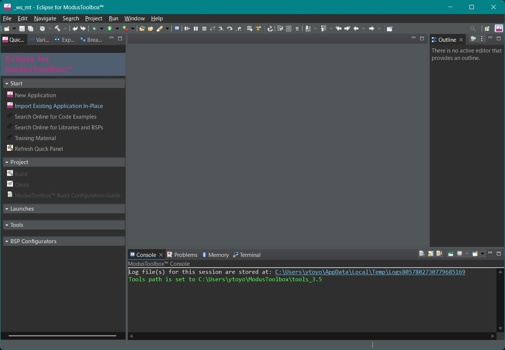
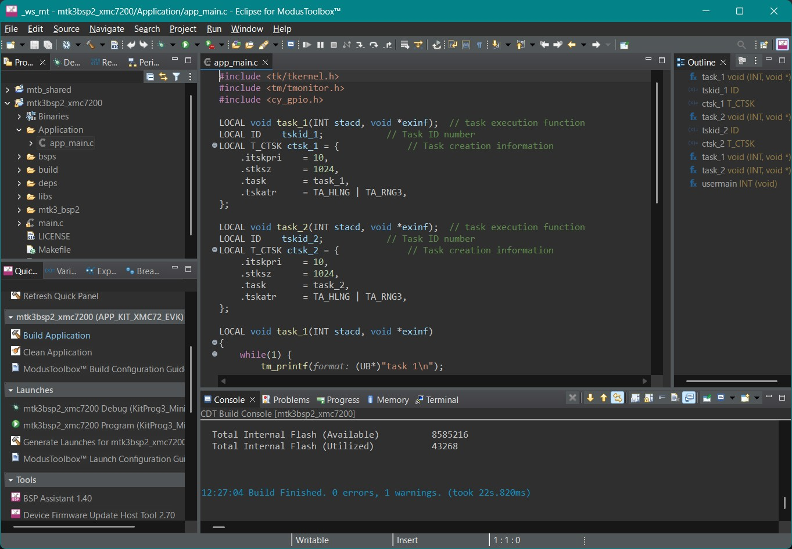
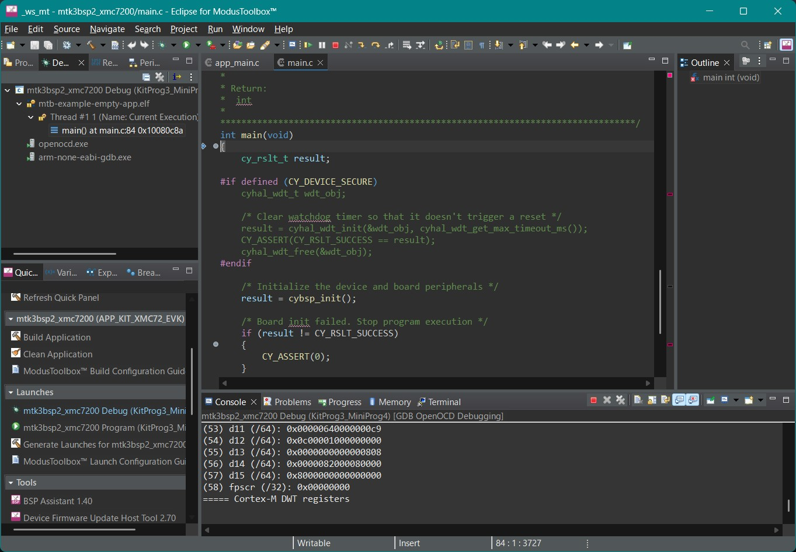

# μT-Kernel 3.0 BSP2 スタートガイド <!-- omit in toc -->
## ModusToolbox & KIT_XMC72_EVK編 Rev.01.00.01 <!-- omit in toc -->
## 2025.06.04 <!-- omit in toc -->

# スタートガイドについて <!-- omit in toc -->

- 本スタートガイドは、μT-Kernel 3.0 BSP2とマイコンメーカの提供するIDE(統合開発環境)を使用して、マイコンボードで実行するプログラムの作成、デバッグの基本的な方法を説明します。
  - μT-Kernel 3.0 BSP2やマイコン、IDEなどの詳細な情報は、それぞれのドキュメントを参照してください。

- 本スタートガイドでは、InfineonのModusToolboxとマイコンボード KIT_XMC72_EVKについて説明します。
  - Eclipse IDE for ModusToolbox 3.5.0にて動作確認をしました。

# 目次<!-- omit in toc -->
- [準備](#準備)
  - [μT-Kernel 3.0 BSP2のダウンロード](#μt-kernel-30-bsp2のダウンロード)
  - [ModusToolboxのインストール](#modustoolboxのインストール)
- [プロジェクトの作成](#プロジェクトの作成)
  - [ModusToolboxの実行](#modustoolboxの実行)
  - [プロジェクトのインポート](#プロジェクトのインポート)
  - [プロジェクトの表示](#プロジェクトの表示)
  - [プロジェクトのビルド](#プロジェクトのビルド)
- [ユーザプログラムの実行とデバッグ](#ユーザプログラムの実行とデバッグ)
  - [ユーザプログラムの作成](#ユーザプログラムの作成)
  - [プログラムの実行とデバッグ](#プログラムの実行とデバッグ)
  - [デバッグ用シリアル通信出力](#デバッグ用シリアル通信出力)
  - [ペリフェラルの制御](#ペリフェラルの制御)
- [変更履歴](#変更履歴)

# 準備
## μT-Kernel 3.0 BSP2のダウンロード

- μT-Kernel 3.0 BSP2のプロジェクト `mtk3bsp2_xmc7200.zip`をダウンロードします。
  - https://github.com/tron-forum/mtk3bsp2_samples/tree/main/IDE_Projects

- Zipファイルを任意のディレクトリに展開します。
  - Zipファイルを展開するディレクトリのパス名に日本語が入らないように注意してください。

## ModusToolboxのインストール

- ModusToolboxのインストーラを以下よりダウンロードしインストールします。
  - https://www.infineon.com/cms/jp/design-support/tools/sdk/modustoolbox-software/
  - ModusToolboxについて詳細は上記のWebサイトをご覧ください。

- インストーラによりModusToolbox Setup がインストールされます。ModusToolbox Setup を実行し、[Eclipse IDE for ModusToolbox 2025.4] と [Modus Toolbox Tools Package 3.5.0] にチェックを入れてインストールしてください。  

# プロジェクトの作成
## ModusToolboxの実行

- インストールしたEclipse for ModusToolboxを実行します。
  - 起動時にワークスペースを聞かれます。任意のディレクトリを指定してください。ここにIDEの各種情報が保存されます。

## プロジェクトのインポート
1. Quick Panelの[Import Existing Application In-Place]を選択します。

2. [Project Location]の[Browse]ボタンを押し、BSP2のプロジェクトのディレクトリを指定します。
3. [Finish]を押下します。

## プロジェクトの表示

- インポートが正常に終了すると、プロジェクトマネージャーにμT-Kernel 3.0 BSP2のプロジェクトが表示されます。
- 表示されているファイルをダブルクリックすると、その内容が表示され、編集ができます。

## プロジェクトのビルド

- プロジェクトマネージャーのプロジェクト名をクリックし、Quick Panelの[Build Application]を選択します。
- プロジェクトのビルドが開始され、正常に終了すると「Build Finished.」が表示されます。

# ユーザプログラムの実行とデバッグ
## ユーザプログラムの作成

- μT-Kernel 3.0 BSP2のApplicationディレクトリにユーザプログラムを記述します。
  - ユーザプログラムのディレクトリは任意の場所に作成可能です。
  - 他のディレクトリから独立に作成しておくと、BSP2のバージョンアップの際に移行が楽になります。
- 初期状態では、タスクを2つ実行し、それぞれのタスクがボード上のLEDの点滅とデバッグ用シリアル出力を行うプログラムがapp_main.cファイルに記述されています。

## プログラムの実行とデバッグ
- ボード(KIT_XMC72_EVK)とPCをUSBで接続します。
  - USBはデバッガI/Fとシリアル通信I/Fを兼ねています。
- プロジェクトを選択した状態でQuick Panelの[mtk3bsp2_xmc7200 Debug(KitProg3_MiniProg4)]を選びます。

- デバッグが開始すると、main.cのmain関数でブレークします。
  - この最初のブレークポイントは、[Debug Configration] の [Startup]タブ内の[Run/Restart Commands]にて変更できます。
- メニューバーのボタンから基本的なデバッグ操作が可能です。
  - ModusToolboxの使用方法は、メーカのWebサイトなどをご覧ください。

## デバッグ用シリアル通信出力
- ボードのプログラムからのtm_printf関数によるデバッグ用シリアル出力は、PCのUSBの仮想シリアルポートに入力されます。
- PCでターミナルソフトを実行すると、デバッグ用シリアル出力を表示することができます。
  - PCのターミナルソフトにはTera Termなどが使用できます。
  - シリアル通信の設定は以下にしてください。

    | 速度 | データ | パリティ | ストップビット | フロー制御 |
    |-|-|-|-|-|
    |115200| 8bit | none | 1bit | none |

## ペリフェラルの制御

- μT-Kernel 3.0 BSP2は、A/DコンバータとI2C通信のサンプルデバイスドライバが組み込まれています。
  - サンプルデバイスドライバからはKIT_XMC72_EVKボードのArduino互換コネクタの以下の信号が使用可能です。
  - 他の信号もプロジェクトのコンフィギュレーション等の変更により使用できます

| Signal Name  | Device Name | Function                   |
| ------------ | ----------- | -------------------------- |
| Arduino A0   | hadcb       | Analog Input               |
| Arduino A1   | hadcb       | Analog Input               |
| Arduino I2C   | hiici       | I2C Communication (Master) |

# 変更履歴

| 版数      | 日付         | 内容                                                      |
| ------- | ---------- | ------------------------------------------------------- |
| 1.00.01 | 2025.06.04 | 英語版の図表を統一  |
| 1.00.00 | 2025.05.29 | 新規作成 |
