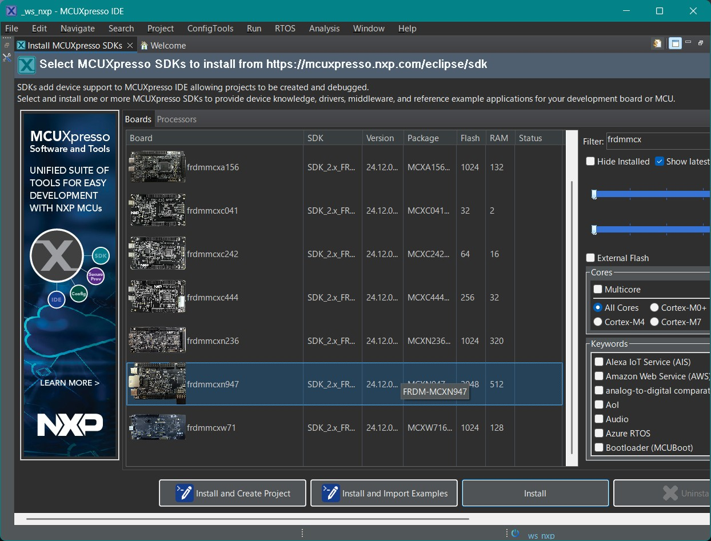
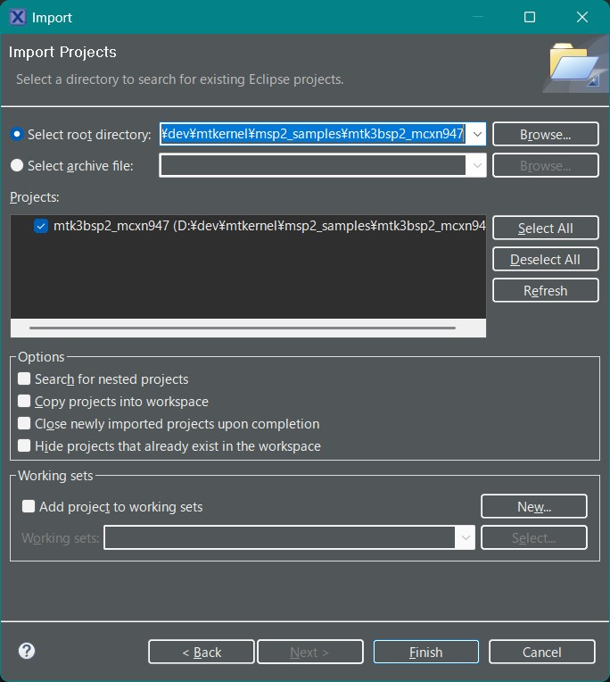
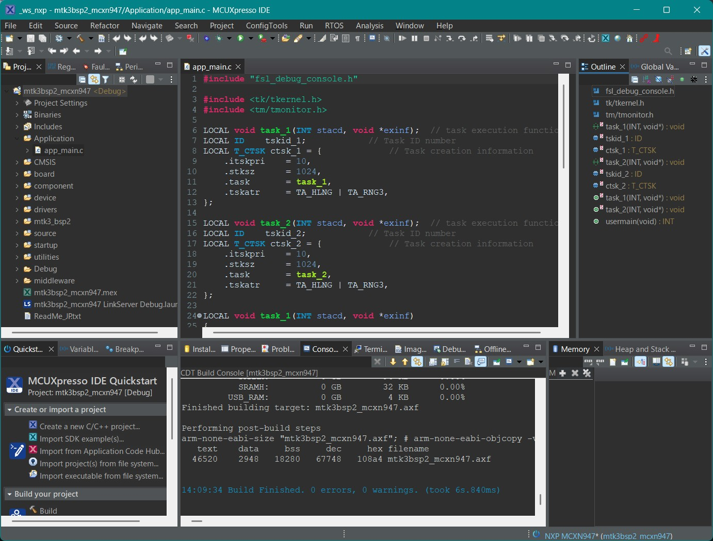
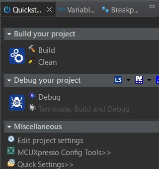
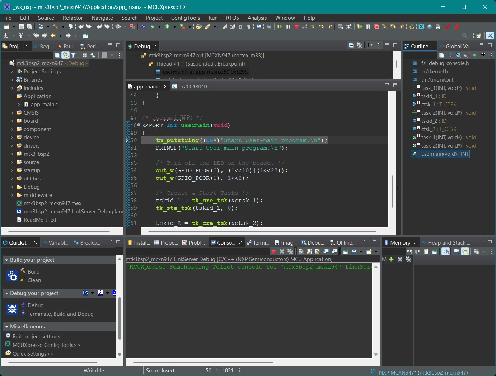
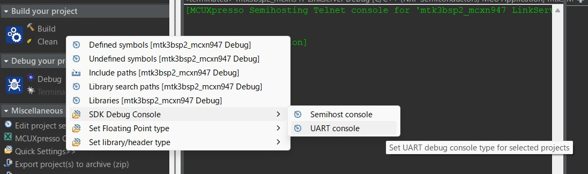

# μT-Kernel 3.0 BSP2 スタートガイド <!-- omit in toc -->
## MCUXpresso IDE & FRDM-MCXN947編  Rev.01.00.01 <!-- omit in toc -->
## 2025.06.04 <!-- omit in toc -->

# スタートガイドについて <!-- omit in toc -->
- 本スタートガイドは、μT-Kernel 3.0 BSP2とマイコンメーカの提供するIDE(統合開発環境)を使用して、マイコンボードで実行するプログラムの作成、デバッグの基本的な方法を説明します。
  - μT-Kernel 3.0 BSP2やマイコン、IDEなどの詳細な情報は、それぞれのドキュメントを参照してください。

- 本スタートガイドでは、NXPのIDE MCUXpresso IDEとマイコンボードFRDM-MCXN947について説明します。
  - MCUXpresso IDE 24.12.148 にて動作確認をしました。

# 目次<!-- omit in toc -->
- [準備](#準備)
  - [μT-Kernel 3.0 BSP2のダウンロード](#μt-kernel-30-bsp2のダウンロード)
  - [MCUXpresso IDEのインストール](#mcuxpresso-ideのインストール)
- [プロジェクトの作成](#プロジェクトの作成)
  - [MCUXpresso IDEの実行](#mcuxpresso-ideの実行)
  - [MCUXpresso SDKのインストール](#mcuxpresso-sdkのインストール)
  - [プロジェクトのインポート](#プロジェクトのインポート)
  - [プロジェクトの表示](#プロジェクトの表示)
  - [プロジェクトのビルド](#プロジェクトのビルド)
- [ユーザプログラムの実行とデバッグ](#ユーザプログラムの実行とデバッグ)
  - [ユーザプログラムの作成](#ユーザプログラムの作成)
  - [プログラムの実行とデバッグ](#プログラムの実行とデバッグ)
  - [デバッグ用シリアル通信出力](#デバッグ用シリアル通信出力)
  - [ペリフェラルの制御](#ペリフェラルの制御)
- [変更履歴](#変更履歴)

# 準備
## μT-Kernel 3.0 BSP2のダウンロード

- μT-Kernel 3.0 BSP2のプロジェクト `mtk3bsp2_mcxn947.zip`をダウンロードします。
  - https://github.com/tron-forum/mtk3bsp2_samples/tree/main/IDE_Projects

- Zipファイルを任意のディレクトリに展開します。
  - Zipファイルを展開するディレクトリのパス名に日本語が入らないように注意してください。

## MCUXpresso IDEのインストール

- 以下のMCUXpresso IDEのインストーラを以下よりダウンロードしインストールします。
  - https://www.nxp.jp/design/design-center/software/development-software/mcuxpresso-software-and-tools-/mcuxpresso-integrated-development-environment-ide:MCUXpresso-IDE
  - MCUXpresso IDEについて詳細は上記のWebサイトをご覧ください。

# プロジェクトの作成
## MCUXpresso IDEの実行

- インストールしたMUCXpresso IDEを実行します。
  - 起動時にワークスペースを聞かれます。任意のディレクトリを指定してください。ここにIDEの各種情報が保存されます。

## MCUXpresso SDKのインストール

- MCUXpresso IDEのWelcome画面からDownload and Install SDKsを選び、frdmmcxn947のSDKをインストールします。

## プロジェクトのインポート
1. メニュー[File]→[Import]を選択します。
2. 開いたダイアログから[General]→[Existing Projects into Workspace]を選択し[Next]を押下します。
3. [Select root directory]の[Browse]ボタンを押し、BSP2のプロジェクトのディレクトリを指定します。
4. BSP2のプロジェクトが表示されていることを確認のうえ[Finish]を押下します。

## プロジェクトの表示

- インポートが正常に終了すると、プロジェクトマネージャーにμT-Kernel 3.0 BSP2のプロジェクトが表示されます。
- 表示されているファイルをダブルクリックすると、その内容が表示され、編集ができます。

## プロジェクトのビルド

- プロジェクトマネージャーのプロジェクト名を右クリックし、[Build Project]を選択します。
- プロジェクトのビルドが開始され、正常に終了すると「Build Finished.」が表示されます。

# ユーザプログラムの実行とデバッグ
## ユーザプログラムの作成

- μT-Kernel 3.0 BSP2のApplicationディレクトリにユーザプログラムを記述します。
  - ユーザプログラムのディレクトリは任意の場所に作成可能です。
  - 他のディレクトリから独立に作成しておくと、BSP2のバージョンアップの際に移行が楽になります。
- 初期状態では、タスクを2つ実行し、それぞれのタスクがボード上のLEDの点滅とデバッグ用シリアル出力を行うプログラムがapp_main.cファイルに記述されています。

## プログラムの実行とデバッグ
- ボード(FRDM-MCXN947)とPCをUSBで接続します。
  - USBはデバッガI/Fとシリアル通信I/Fを兼ねています。
- [Quickstart Panel]の[Debug your project]の[Debug]、またはツールバーのボタンから、デバッグを開始できます。

- デバッグが開始すると、app_main.cのusermain関数でブレークします。
- メニューバーのボタンから以下の基本的なデバッグ操作が可能です。
  - MCUXpresso IDEの使用方法は、メーカのWebサイトなどをご覧ください。

## デバッグ用シリアル通信出力
- SDKのPRINTF関数によりデバッグ出力を行うことができます。

- デバッグ出力の出力先は[Quickstart Panel]の[Miscellaneous]の[Quick Setting]から[SDK Debug Console]を選び、以下が選択できます。
  - Semihost console
  - UART console

- PRINTF関数の出力先をUART consoleとした場合、PCのUSBの仮想シリアルポートに入力されます。
- PCでターミナルソフトを実行すると、デバッグ用シリアル出力を表示することができます。
  - PCのターミナルソフトにはTera Termなどが使用できます。
  - シリアル通信の設定は以下にしてください。

    | 速度 | データ | パリティ | ストップビット | フロー制御 |
    |-|-|-|-|-|
    |115200| 8bit | none | 1bit | none |

## ペリフェラルの制御

- μT-Kernel 3.0 BSP2は、A/DコンバータとI2C通信のサンプルデバイスドライバが組み込まれています
  - サンプルデバイスドライバからはFRDM-MCXN947ボードのArduino互換コネクタの以下の信号が使用可能です
  - 他の信号もプロジェクトのコンフィギュレーション等の変更により使用できます

| Signal Name  | Device Name | Function                   |
| ------------ | ----------- | -------------------------- |
| Arduino A0   | hadca       | Analog Input               |
| Arduino A1   | hadca       | Analog Input               |
| Arduino I2C   | hiica       | I2C Communication (Master) |

# 変更履歴

| 版数      | 日付         | 内容                                                      |
| ------- | ---------- | ------------------------------------------------------- |
| 1.00.01 | 2025.06.04 | 英語版の図表を統一  |
| 1.00.00 | 2025.05.29 | 新規作成 |