# μT-Kernel 3.0 BSP2 スタートガイド <!-- omit in toc -->
## e² studio & RAマイコン編  Rev.01.00.00 <!-- omit in toc -->
## 2025.05.29 <!-- omit in toc -->

# スタートガイドについて <!-- omit in toc -->
- 本スタートガイドは、μT-Kernel 3.0 BSP2とマイコンメーカの提供するIDE(統合開発環境)を使用して、マイコンボードで実行するプログラムの作成、デバッグの基本的な方法を説明します。
  - μT-Kernel 3.0 BSP2やマイコン、IDEなどの詳細な情報は、それぞれのドキュメントを参照してください。

- 本スタートガイドでは、ルネサス エレクトロニクスのIDE e² studioと以下のマイコンボードについて説明します。
  - e² studio 2025-04にて動作確認をしました。
      - EK-RA8M1        
      - EK-RA8D1
      - RA4M1 Clicker

# 目次
- [目次](#目次)
- [準備](#準備)
  - [μT-Kernel 3.0 BSP2のダウンロード](#μt-kernel-30-bsp2のダウンロード)
  - [e² studioのインストール](#e-studioのインストール)
- [プロジェクトの作成](#プロジェクトの作成)
  - [e² studioの実行](#e-studioの実行)
  - [プロジェクトのインポート](#プロジェクトのインポート)
  - [プロジェクトの表示](#プロジェクトの表示)
  - [プロジェクトのビルド](#プロジェクトのビルド)
- [ユーザプログラムの実行とデバッグ](#ユーザプログラムの実行とデバッグ)
  - [ユーザプログラムの作成](#ユーザプログラムの作成)
  - [デバッグ構成の作成](#デバッグ構成の作成)
  - [デバッグ実行](#デバッグ実行)
  - [ペリフェラルの制御](#ペリフェラルの制御)
  - [デバッグ用シリアル通信出力](#デバッグ用シリアル通信出力)
  - [SEGGER RTTによるデバッグ用出力](#segger-rttによるデバッグ用出力)
- [変更履歴](#変更履歴)

# 準備
## μT-Kernel 3.0 BSP2のダウンロード

- μT-Kernel 3.0 BSP2の該当するマイコンボードのプロジェクトを以下からダウンロードします。
  - https://github.com/tron-forum/mtk3bsp2_samples/tree/main/IDE_Projects

- ダウンロードするプロジェクトは以下のZipファイルです。

  - EK-RA8M1 の場合　　mtk3bsp2_ra8m1.zip
  - EK-RA8D1 の場合　　mtk3bsp2_ra8d1.zip
  - RA4M1 Clicker の場合　　mtk3bsp2_ra4m1clicker.zip

- Zipファイルを任意のディレクトリに展開します。
  - Zipファイルを展開するディレクトリのパス名に日本語が入らないように注意してください。

## e² studioのインストール

- Flexible Software Package (FSP)のインストーラを以下よりダウンロードしインストールします。
  - https://www.renesas.com/jp/ja/software-tool/flexible-software-package-fsp
  - 統合開発環境（e² studio）も一緒にインストールされます。
  - e² studio、FSPについて詳細は上記のWebサイトをご覧ください。

# プロジェクトの作成
## e² studioの実行

- インストールしたe² studioを実行します。
  - 起動時にワークスペースを聞かれます。任意のディレクトリを指定してください。ここにIDEの各種情報が保存されます。

## プロジェクトのインポート
1. メニュー[ファイル]→[インポート]を選択します。
2. 開いたダイアログから[一般]→[既存プロジェクトをワークスペースへ]を選択し[次へ]を押下します。
3. [ルート・ディレクトリの選択]の[参照]ボタンを押し、BSP2のプロジェクトのディレクトリを指定します。
4. BSP2のプロジェクトが表示されていることを確認のうえ[終了]を押下します。

## プロジェクトの表示

- インポートが正常に終了すると、プロジェクトマネージャーにμT-Kernel 3.0 BSP2のプロジェクトが表示されます。
  - ようこそ画面が全面表示されているときは、[X]にて閉じてください。
  - 使用している FSP が更新されている場合は、対応するFSPのインストールが要求されます。[Apply and Close]をクリックしてインストールしてください。
- 表示されているファイルをダブルクリックすると、その内容が表示され、編集ができます。

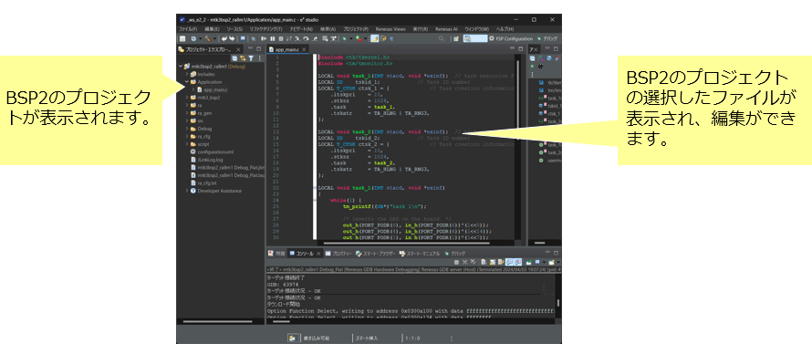

## プロジェクトのビルド

- プロジェクトエクスプローラーのプロジェクト名を選択後、右クリックして [プロジェクトのビルド] を選択します。
- プロジェクトのビルドが開始され、正常に終了すると「Build Finished.」が表示されます。

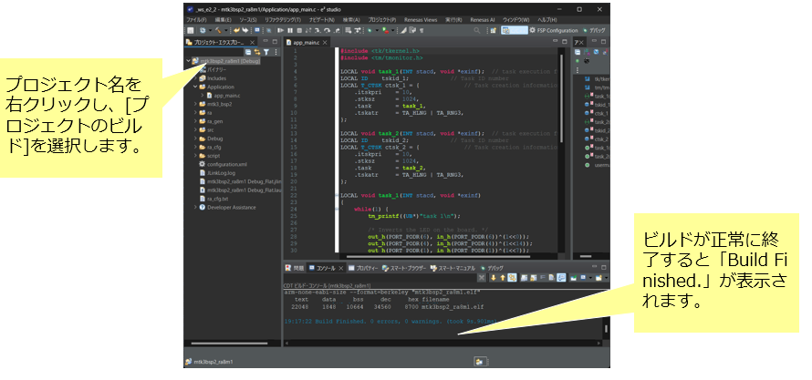

# ユーザプログラムの実行とデバッグ
## ユーザプログラムの作成

- μT-Kernel 3.0 BSP2のApplicationディレクトリにユーザプログラムを記述します。
  - ユーザプログラムのディレクトリは任意の場所に作成可能です。
  - 他のディレクトリから独立に作成しておくと、BSP2のバージョンアップの際に移行が楽になります。
- 初期状態では、タスクを2つ実行し、それぞれのタスクがボード上のLEDの点滅とデバッグ用シリアル出力を行うプログラムがapp_main.cファイルに記述されています。

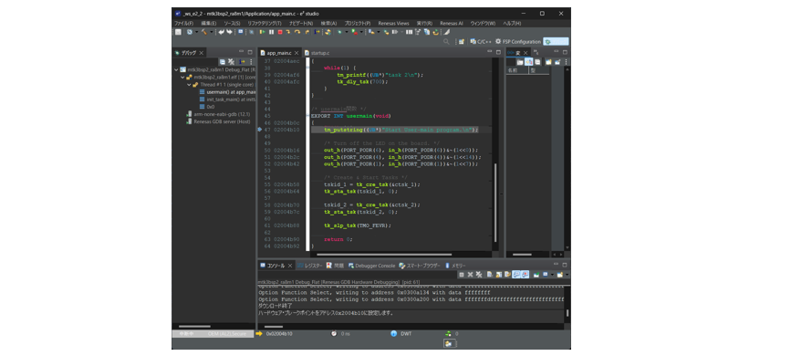

## デバッグ構成の作成
- プロジェクトマネージャーのプロジェクト名を選択した状態でメニュー[実行]から[デバッグの構成]を選びます。

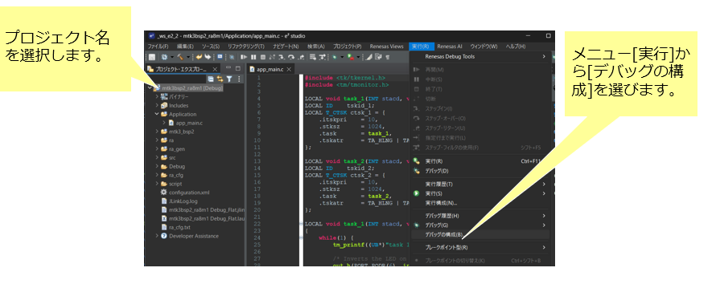

- 表示されたダイアログから[Renesas GDB Hardware Debugging]から対象プロジェクトのデバッグ構成を選択します。デバッグ構成は[プロジェクト名 Debug_Flat]という名称で表示されています。  
  - 該当するデバッグ構成が表示されていない場合は、[Renesas GDB Hardware Debugging]をダブルクリックしてください。直前にビルドしたプロジェクトのデバッグ構成が作成されます。ビルドの直後に操作してください。
- 以下の図はEK-RA8M1の場合です。プロジェクト名はマイコンボードにより変わります。

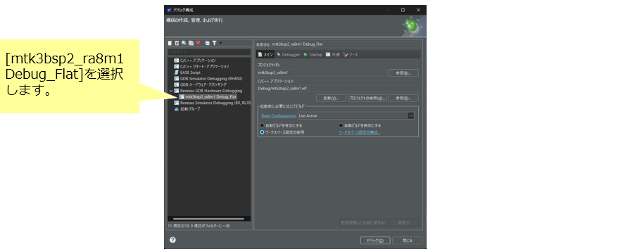

- [Debugger]タブを選択し以下を確認します。
  - Debug hardware : J-Link ARM
  - Target Deveice : (対象のマイコンの型名)

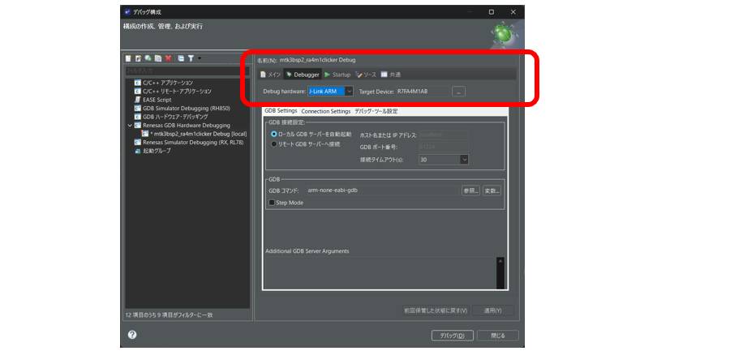

- [Startup]タブを選択し以下を設定します。
  - ブレークポイント設定先: usermain
    - デバッグ実行時にブレークポイントを設定する関数名です

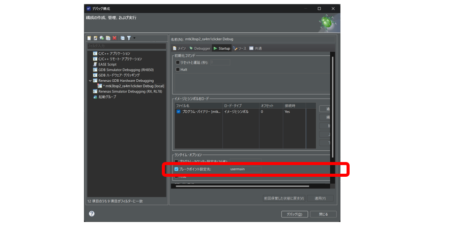

## デバッグ実行
- マイコンボードとPCをUSBで接続します。
- シリアル通信を行う場合は、ボードのUARTをUSBシリアル変換器を介して、PCのUSBに接続します。
- ダイアログの[デバッグ]ボタンを押すと、実行プログラムがボードに転送されて実行されデバッグが始まります。
- [デバッグ・パースペクティブ]への切り替えが表示されますので[切り替え]ボタンを押下します。デバッグ画面に切り替わります。

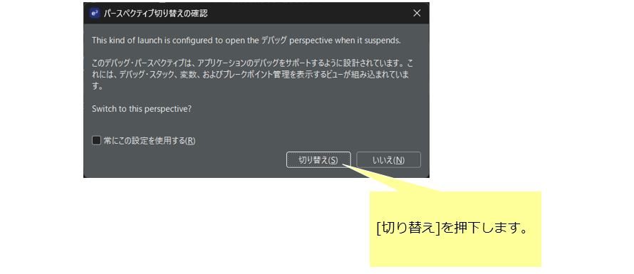

- 最初にリセットハンドラ(Reset_Handler)で停止します。
- 実行を開始するとapp_main.cのusermain関数でブレークします。
- メニューバーのボタンから基本的なデバッグ操作が可能です。
  - e² studioの使用方法は、メーカのWebサイトなどをご覧ください。

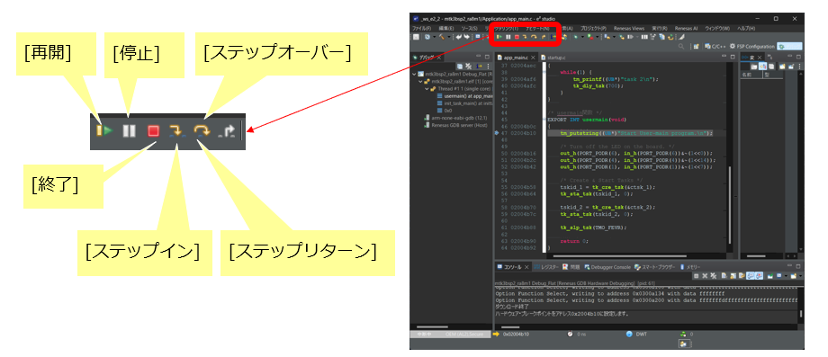

## ペリフェラルの制御

- μT-Kernel 3.0 BSP2は、A/DコンバータとI2C通信のサンプルデバイスドライバが組み込まれています。
  - マイコンボードのコネクタの信号が使用可能です。
  - 他の信号もプロジェクトのコンフィギュレーション等の変更により使用できます

- EK-RA8M1およびEK-RA8D1ではArduino互換コネクタの以下の信号が使用可能です。

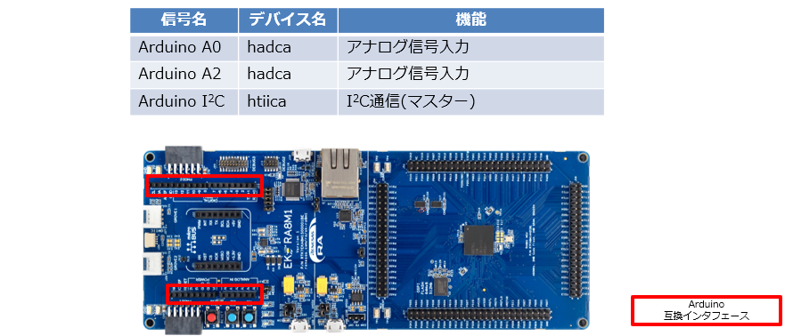

- RA4M1 ClickerではmikroBUSコネクタの以下の信号が使用可能です。

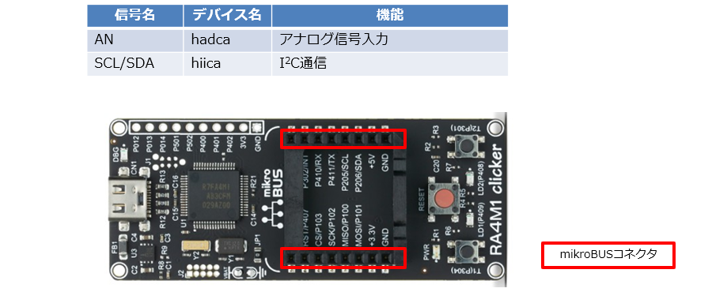

## デバッグ用シリアル通信出力
- プログラムからのtm_printf関数によりマイコンボードのシリアル通信信号に出力できます。
- PCでターミナルソフトを実行すると、デバッグ用シリアル出力を表示することができます。
  - PCのターミナルソフトにはTera Termなどが使用できます。
  - シリアル通信の設定は以下にしてください。

    | 速度 | データ | パリティ | ストップビット | フロー制御 |
    |-|-|-|-|-|
    |115200| 8bit | none | 1bit | none |

## SEGGER RTTによるデバッグ用出力

- J-LinkデバッガにはRTTというデバッグ用の通信機能があります。
  - SEGGER_RTT_printf関数によりデバッグ用通信に出力できます。
  - 詳細は以下をご覧ください  
   https://www.segger.com/products/debug-probes/j-link/technology/about-real-time-transfer/
- PCでJ-Link RTT Viewerを実行します。
  - 起動時に対象マイコンなどを設定します。

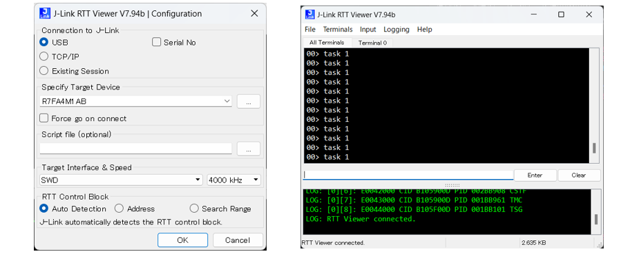

# 変更履歴

| 版数      | 日付         | 内容                                                      |
| ------- | ---------- | ------------------------------------------------------- |
| 1.00.00 | 2025.05.29 | 新規作成 |
