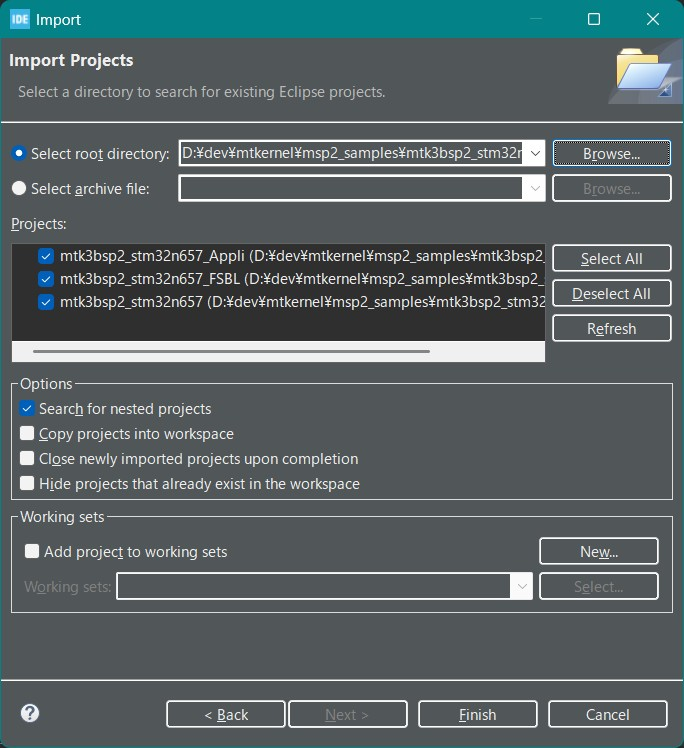
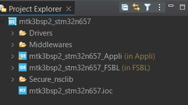
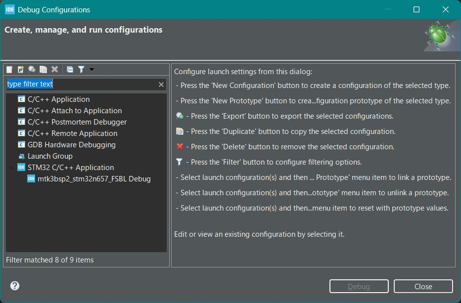
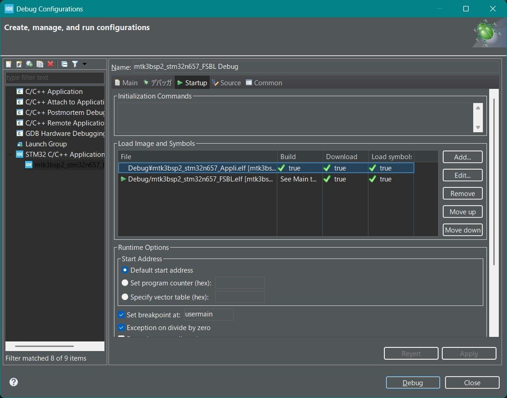

# μT-Kernel 3.0 BSP2 スタートガイド <!-- omit in toc -->
## STM32Cube & STM32N6570-DK編  Rev.01.00.00 <!-- omit in toc -->
## 2025.05.29 <!-- omit in toc -->

## スタートガイドについて <!-- omit in toc -->
- 本スタートガイドは、μT-Kernel 3.0 BSP2とマイコンメーカの提供するIDE(統合開発環境)を使用して、マイコンボードで実行するプログラムの作成、デバッグの基本的な方法を説明します。
  - μT-Kernel 3.0 BSP2やマイコン、IDEなどの詳細な情報は、それぞれのドキュメントを参照してください。

- 本スタートガイドでは、STマイクロエレクトロニクスのIDE STM32CubeIDEとマイコンボードSTM32N6570-DKについて説明します。
  - STM32CubeIDE 1.18.1 にて動作確認をしました。
  
- STM32N657はTrustZoneが有効となっています。μT-Kernel 3.0はセキュアでのみ実行しますので、非セキュアは使用しません。  
  サンプルプロジェクトは、FSBL(First Stage Boot Loader)とセキュアのアプリケーションから構成され、FSBLがFLASHメモリに書き込まれたアプリケーションをRAMにロードに実行します。

# 目次

- [目次](#目次)
- [準備](#準備)
  - [μT-Kernel 3.0 BSP2のダウンロード](#μt-kernel-30-bsp2のダウンロード)
  - [STM32CubeIDEのインストール](#stm32cubeideのインストール)
- [プロジェクトの作成](#プロジェクトの作成)
  - [STM32CubeIDEの実行](#stm32cubeideの実行)
  - [プロジェクトのインポート](#プロジェクトのインポート)
  - [プロジェクトの表示](#プロジェクトの表示)
  - [プロジェクトのビルド](#プロジェクトのビルド)
- [ユーザプログラムの実行とデバッグ](#ユーザプログラムの実行とデバッグ)
  - [ユーザプログラムの作成](#ユーザプログラムの作成)
  - [デバッグ構成の作成](#デバッグ構成の作成)
  - [デバッグ実行](#デバッグ実行)
  - [FLASHメモリからの実行](#flashメモリからの実行)
  - [ペリフェラルの制御](#ペリフェラルの制御)
  - [デバッグ用シリアル通信出力](#デバッグ用シリアル通信出力)
- [変更履歴](#変更履歴)

# 準備
## μT-Kernel 3.0 BSP2のダウンロード

- μT-Kernel 3.0 BSP2のプロジェクト `mtk3bsp2_stm32n657.zip` をダウンロードします。
  - https://github.com/tron-forum/mtk3bsp2_samples/tree/main/IDE_Projects

- Zipファイルを任意のディレクトリに展開します。
  - Zipファイルを展開するディレクトリのパス名に日本語が入らないように注意してください。

## STM32CubeIDEのインストール

- 以下のSTM32CubeIDEのインストーラを以下よりダウンロードしインストールします。
  - https://www.st.com/ja/development-tools/stm32cubeide.html

  - STM32CubeIDEについて詳細は上記のWebサイトをご覧ください。

# プロジェクトの作成
## STM32CubeIDEの実行

- インストールしたSTM32CubeIDEを実行します。
  - 起動時にワークスペースを聞かれます。任意のディレクトリを指定してください。ここにIDEの各種情報が保存されます。

## プロジェクトのインポート
1. メニュー[File]→[Import]を選択します。
2. 開いたダイアログから[General]→[Existing Projects into Workspace]を選択し[Next]を押下します。
3. [Select root directory]の[Browse]ボタンを押し、BSP2のプロジェクトのディレクトリを指定します。
4. BSP2のプロジェクトが表示されていることを確認のうえ[Finish]を押下します。本プロジェクトはマルチプロジェクト構成ですので、3個のプロジェクトが表示されます。  

## プロジェクトの表示

- インポートが正常に終了すると、プロジェクトマネージャーにμT-Kernel 3.0 BSP2のプロジェクトが表示されます。
- 本プロジェクトはマルチプロジェクト構成ですので`mtk3bsp2_stm32n657`プロジェクトの中に`mtk3bsp2_stm32n657_FSBL`と`mtk3bsp2_stm32n657_Appli`の2個のサブプロジェクトがあります。前者がFSBL(First Stage Boot Loader)、後者がアプリケーションのプロジェクトです。
- 表示されているファイルをダブルクリックすると、その内容が表示され、編集ができます。

## プロジェクトのビルド

- プロジェクトマネージャーのプロジェクト名を右クリックし、[Build Project]を選択します。
  - 本プロジェクトは2個のサブプロジェクトがありますので、それぞれに対してビルドを行ってください。
- プロジェクトのビルドが開始され、正常に終了すると「Build Finished.」が表示されます。

# ユーザプログラムの実行とデバッグ
## ユーザプログラムの作成

- μT-Kernel 3.0 BSP2の`mtk3bsp2_stm32n657_Appli`サブプロジェクトの中のApplicationディレクトリにユーザプログラムを記述します。
  - ユーザプログラムのディレクトリはサブプロジェクト内の任意の場所に作成可能です。
  - 他のディレクトリから独立に作成しておくと、BSP2のバージョンアップの際に移行が楽になります。
- 初期状態では、タスクを2つ実行し、それぞれのタスクがボード上のLEDの点滅とデバッグ用シリアル出力を行うプログラムがapp_main.cファイルに記述されています。

## デバッグ構成の作成

- `mtk3bsp2_stm32n657_FSBL`サブプロジェクトをビルドした後にメニュー[Run]から[Debug Configurations]を選びます。
  - 必ずメニューを選ぶ前に`mtk3bsp2_stm32n657_FSBL`サブプロジェクトのビルドを実行してください。  

- 表示されたダイアログから[STM32 C/C++ Application]の[mtk3bsp2_stm32n657_FSBL Debug]を選択します。
  - [mtk3bsp2_stm32n657_FSBL Debug]が表示されていない場合は、[STM32 C/C++ Application]をダブルクリックしてください。直前にビルドしたプロジェクトが対象となります。ビルドの直後に操作してください。
  - [mtk3bsp2_stm32n657_Appli Debug]ではありませんので注意してください。`FSBL`であることを必ず確認します。    

- [mtk3bsp2_stm32n657_FSBL Debug]を選択した状態で[Startup]タブを開きます。[Add...]ボタンを押下し、`mtk3bsp2_stm32n657_Appli`サブプロジェクトを追加します。以下のように[Project]に`mtk3bsp2_stm32n657_Appli`を選びます。  

- [OK]ボタンを押下すると、`mtk3bsp2_stm32n657_Appli`サブプロジェクトが追加されます。

## デバッグ実行
- マイコンボードの上のSW1(BOOT1)スライドスイッチを1-3側に設定しDevelopment bootのモードとします。
- マイコンボードとPCをUSBで接続します。USBコネクタはSTLINKと書かれている方です。
  - USBはデバッガI/Fとシリアル通信I/Fを兼ねています。

- ダイアログの[Debug]ボタンを押すと、実行プログラムがボードに転送されて実行されデバッグが始まります。
- [Debug perspective]への切り替えが表示されますので[Switch]ボタンを押下します。デバッグ画面に切り替わります。

- デバッグが開始すると、app_main.cのusermain関数でブレークします。
- メニューバーのボタンから以下の基本的なデバッグ操作が可能です。
  - STM32Cube IDEの使用方法は、メーカのWebサイトなどをご覧ください。

## FLASHメモリからの実行
- 本プロジェクトはFSBL(First Stage Boot Loader)がFLASHメモリに書き込まれたアプリケーションをRAMにロードに実行します。ただし、デバッグ実行の際は、デバッガからFSBLと共にアプリケーションの実行プログラムも転送しています。
- デバッガを使用せずに実機のみでプログラムを実行する際には、各サブプロジェクトのコンフィギュレーションを`Debug`から`Release`に変更してビルドする必要はあります。コンフィギュレーションの変更は、各サブプロジェクトを右クリックし、[Build Configurations]->[Set Active]から[Release]を選択します。変更後はビルドを実行する必要があります。  
- STM32N657のFLASHメモリへの書き込みなどはマイコンのドキュメントをご覧ください。  

## ペリフェラルの制御

- μT-Kernel 3.0 BSP2は、A/DコンバータとI2C通信のサンプルデバイスドライバが組み込まれています。
  - サンプルデバイスドライバからはSTM32N6570-DKボードのArduino互換コネクタの以下の信号が使用可能です。
  - 他の信号もプロジェクトのコンフィギュレーション等の変更により使用できます。

    |信号名|デバイス名|機能|
    |-|-|-|
    | Arduino A0 | hadca| アナログ入力 |
    | Arduino A1 | hadca| アナログ入力 |
    | Arduino I2C | hiica | I2C通信（マスター）|

## デバッグ用シリアル通信出力
- ボードのプログラムからのtm_printf関数によるデバッグ用シリアル出力は、PCのUSBの仮想シリアルポートに入力されます。
- PCでターミナルソフトを実行すると、デバッグ用シリアル出力を表示することができます。
  - PCのターミナルソフトにはTera Termなどが使用できます。
  - シリアル通信の設定は以下にしてください。

    | 速度 | データ | パリティ | ストップビット | フロー制御 |
    |-|-|-|-|-|
    |115200| 8bit | none | 1bit | none |

# 変更履歴

| 版数      | 日付         | 内容                                                      |
| ------- | ---------- | ------------------------------------------------------- |
| 1.00.00 | 2025.05.29 | 新規作成 |